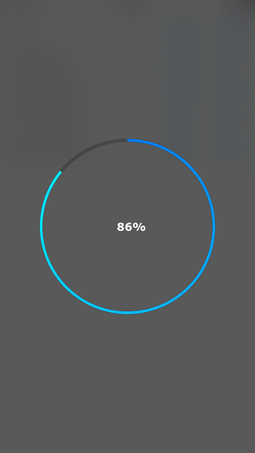
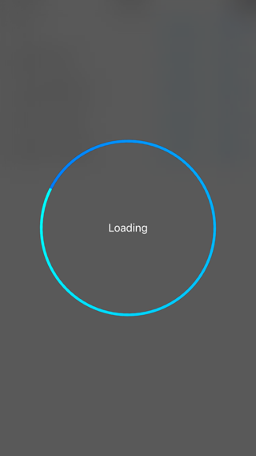
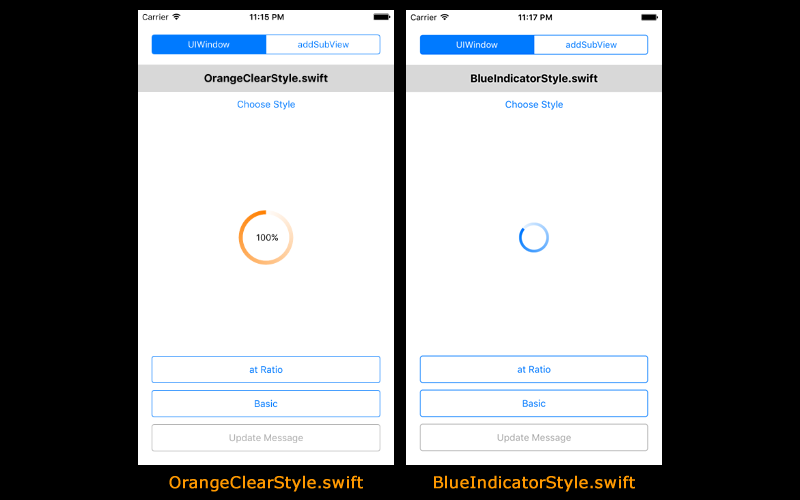

# Gradient Circular Progress

Customizable progress indicator library in Swift

## Requirements
- Swift 1.2
- iOS 8.0 or later

## Screen Shots

- Preset style: [BlueDarkStyle.swift](https://github.com/keygx/GradientCircularProgress/blob/master/Source/BlueDarkStyle.swift)

  

- All preset styles

 
 

## Installation

###CocoaPods

* PodFile [Sample/PodFile]

```PodFile
source 'https://github.com/CocoaPods/Specs.git'
platform :ios, '8.0'
use_frameworks!

pod 'GradientCircularProgress', :git => 'https://github.com/keygx/GradientCircularProgress'
```
* install

```
$ pod install
```

###Carthage

* Cartfile

```Cartfile
github "keygx/GradientCircularProgress"
```

```
$ carthage update
```
* install

To integrate "GradientCircularProgress.framework" into your Xcode project


## Style Settings

Please make your original style


- Inheritance Style class and override properties

```swift
import GradientCircularProgress

public class MyStyle : Style {
    
    override init() {
        super.init()
        /*** style properties **********************************************************************************/
        // Progress Size
        self.progressSize = 200
        
        // Gradient Circular
        self.arcLineWidth = 18.0
        self.startArcColor = UIColor.darkGrayColor()
        self.endArcColor = UIColor.greenColor()
        
        // Base Circular
        self.baseLineWidth = 19.0
        self.baseArcColor = UIColor.darkGrayColor()
        
        // Percentage
        self.ratioLabelFont = UIFont(name: "Verdana-Bold", size: 16.0)!
        self.ratioLabelFontColor = UIColor.whiteColor()
        
        // Message
        self.messageLabelFont = UIFont.systemFontOfSize(16.0)
        self.messageLabelFontColor = UIColor.whiteColor()
        
        // Background
        self.backgroundStyle = .Dark
        /*** style properties **********************************************************************************/
    }
}

```

## Usage
```swift
import GradientCircularProgress
```
```swift
var progress = GradientCircularProgress()

let ratio: CGFloat = CGFloat(totalBytesWritten) / CGFloat(totalBytesExpectedToWrite)        

progress.showAtRatio(style: MyStyle())
progress.updateRatio(ratio)
progress.dismiss()
```
```swift
var progress = GradientCircularProgress()

progress.show(message: "Loading...", MyStyle())
progress.dismiss()
```

## Download Progress Examples

### NSURLSession

```swift
var progress = GradientCircularProgress()

~~

progress.showAtRatio(style: BlueDarkStyle())
        
let url = NSURL(string: "http://example.com/download/dummy.mp4")
let config = NSURLSessionConfiguration.defaultSessionConfiguration()
let session = NSURLSession(configuration: config, delegate: self, delegateQueue: NSOperationQueue.mainQueue())
let task = session.downloadTaskWithURL(url!)
task.resume()

~~

// Delegate
func URLSession(session: NSURLSession, downloadTask: NSURLSessionDownloadTask, didWriteData bytesWritten: Int64, totalBytesWritten: Int64, totalBytesExpectedToWrite: Int64) {
    let ratio: CGFloat = CGFloat(totalBytesWritten) / CGFloat(totalBytesExpectedToWrite)
    progress.updateRatio(ratio)
}
// Delegate
func URLSession(session: NSURLSession, downloadTask: NSURLSessionDownloadTask, didFinishDownloadingToURL location: NSURL) {
    progress.dismiss()
}
```

### Alamofire

```swift
var progress = GradientCircularProgress()

~~

progress.showAtRatio(style: BlueDarkStyle())

Alamofire.request(.GET, "http://example.com/download/dummy.mp4")
    .response { (request, response, data, error) in
        
        self.progress.dismiss()
}
    .progress { (bytesRead, totalBytesRead, totalBytesExpectedToRead) in
        let ratio: CGFloat = CGFloat(totalBytesRead) / CGFloat(totalBytesExpectedToRead)
        // Call main thread.
        dispatch_async(dispatch_get_main_queue(), {
            self.progress.updateRatio(ratio)
        })
}
```

## API
```swift
public func showAtRatio(display: Bool = true, style: Style = Style())

public func updateRatio(ratio: CGFloat)

public func show(style: Style = Style())

public func show(#message: String, style: Style = Style())

public func dismiss()

public func dismiss(completionHandler: () -> Void) -> ()
```

## License

Gradient Circular Progress is released under the MIT license. See LICENSE for details.

## Author

Yukihiko Kagiyama (keygx) <https://twitter.com/keygx>

